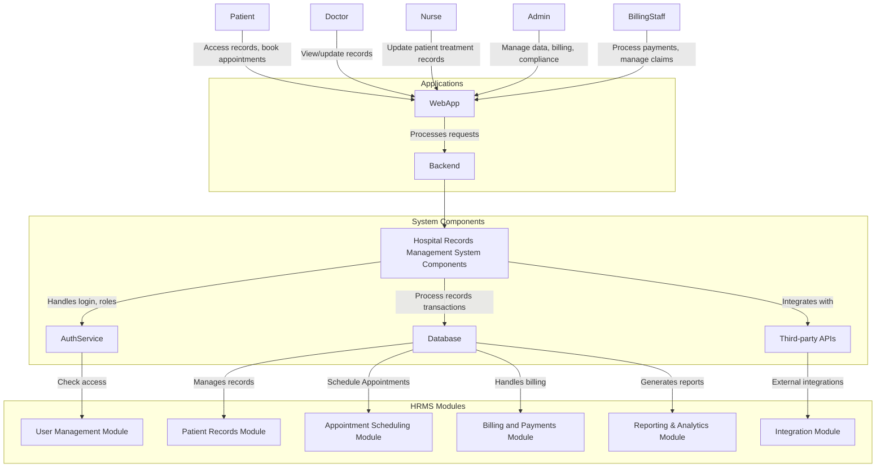

```mermaid
flowchart TD
 subgraph s1["Applications"]
        Backend["Backend"]
        WebApp["WebApp"]
  end
 subgraph s2["System Components"]
        n2["Hospital Records Management System Components"]
        Database["Database"]
        AuthService["AuthService"]
        ExternalAPIs["Third-party APIs"]
  end
 subgraph s3["HRMS Modules"]
        UserModule["User Management Module"]
        PatientRecords["Patient Records Module"]
        Appointments["Appointment Scheduling Module"]
        Billing["Billing and Payments Module"]
        Reporting["Reporting & Analytics Module"]
        Integration["Integration Module"]
  end

    Patient["Patient"] -- Access records, book appointments --> WebApp
    Doctor["Doctor"] -- View/update records --> WebApp
    Nurse["Nurse"] -- Update patient treatment records --> WebApp
    Admin["Admin"] -- Manage data, billing, compliance --> WebApp
    BillingStaff["BillingStaff"] -- Process payments, manage claims --> WebApp
    WebApp -- Processes requests --> Backend

    Backend --> n2

    n2 -- Handles login, roles --> AuthService
    AuthService -- Check access --> UserModule

    n2 -- Process records transactions  --> Database;
    Database -- Manages records --> PatientRecords
    Database -- Schedule Appointments --> Appointments
    Database -- Handles billing --> Billing
    Database -- Generates reports --> Reporting
    
    n2 -- Integrates with --> ExternalAPIs
    ExternalAPIs -- External integrations --> Integration
  
```
