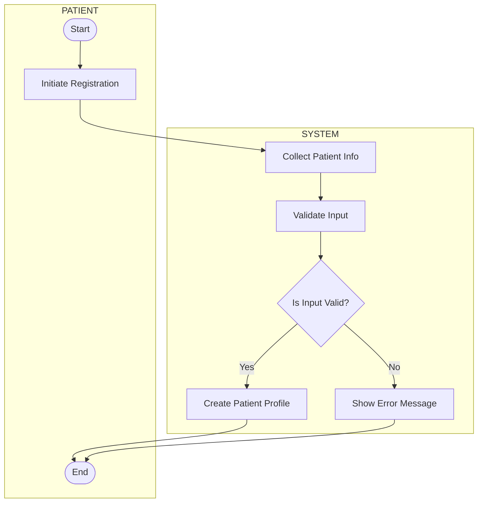
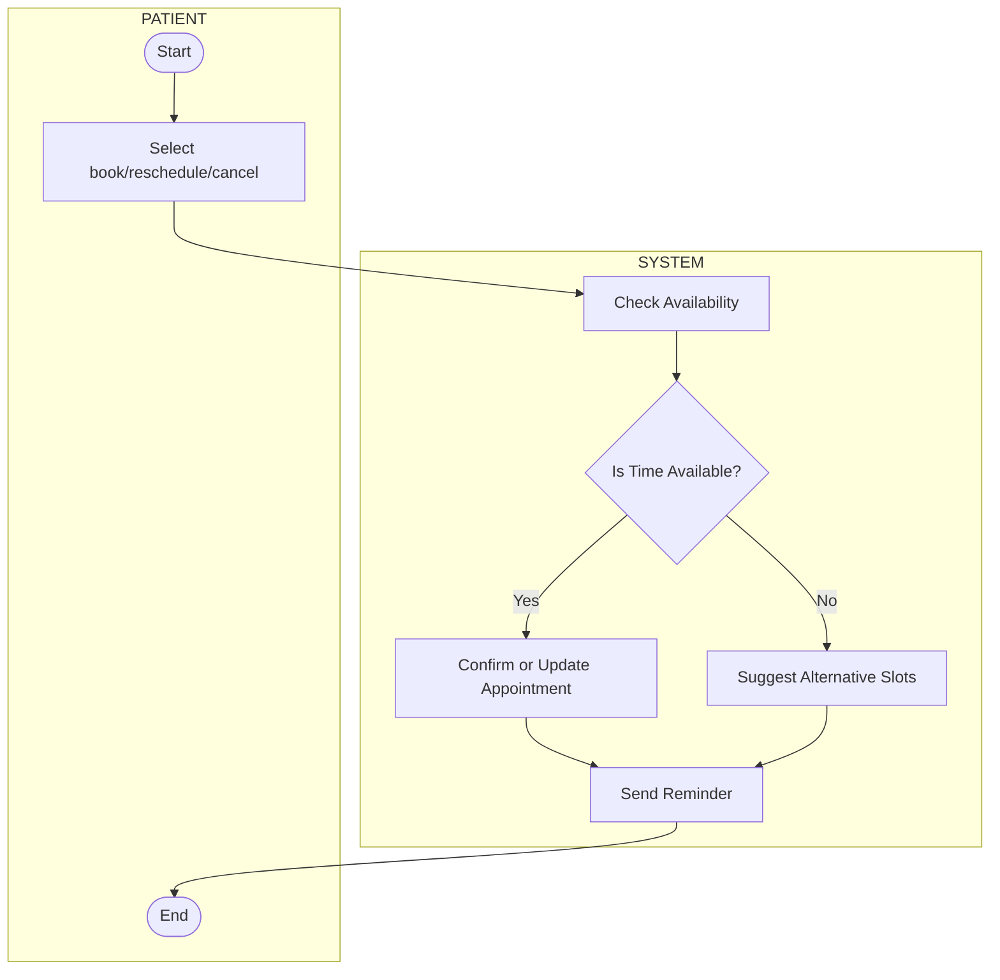
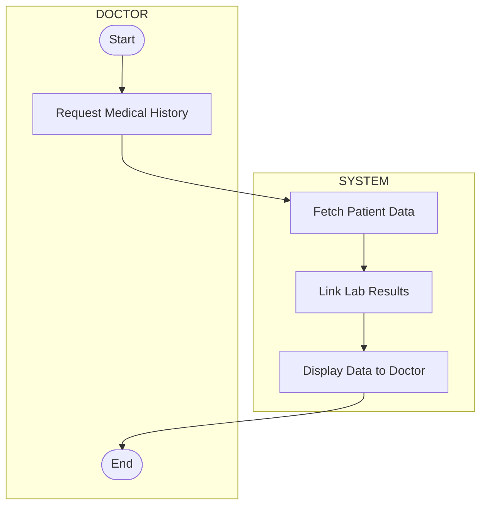
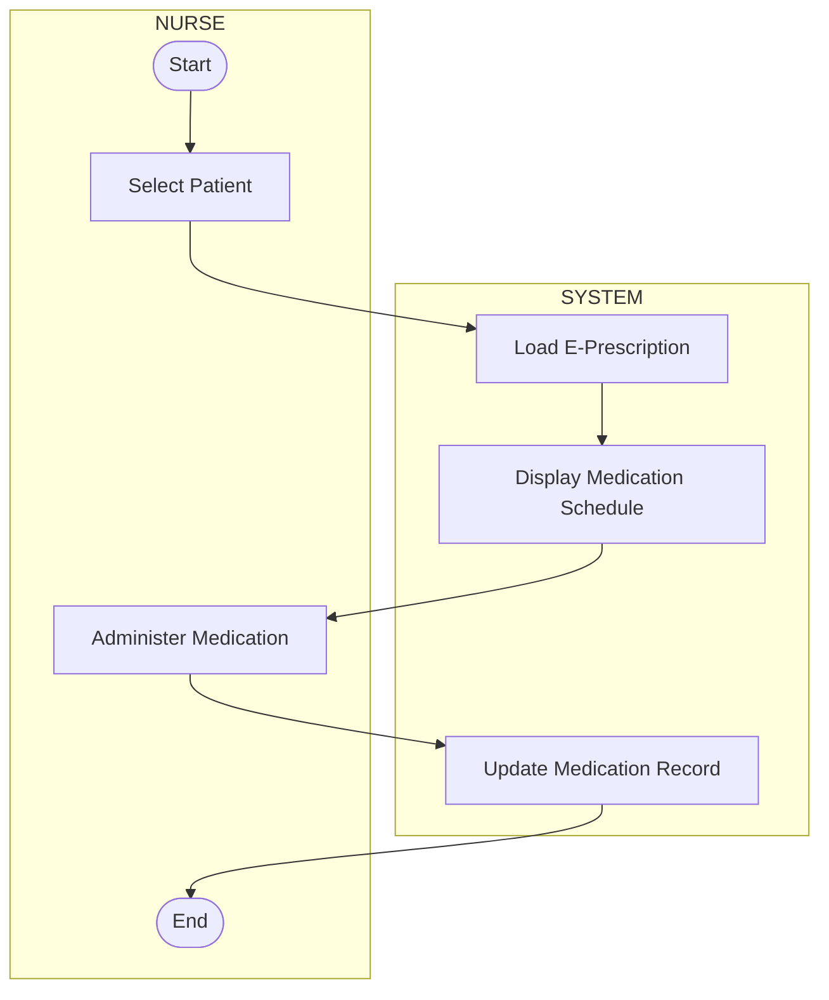
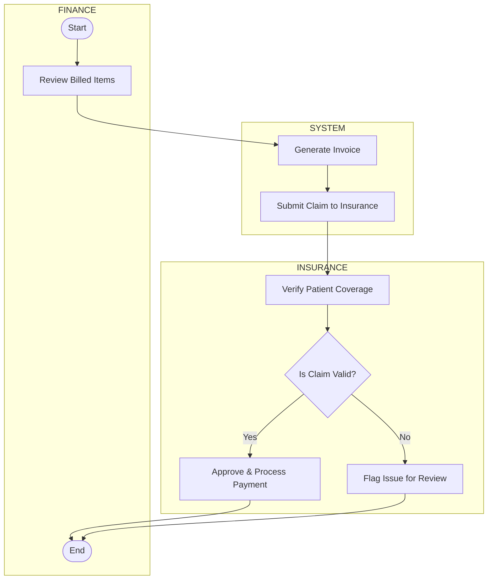
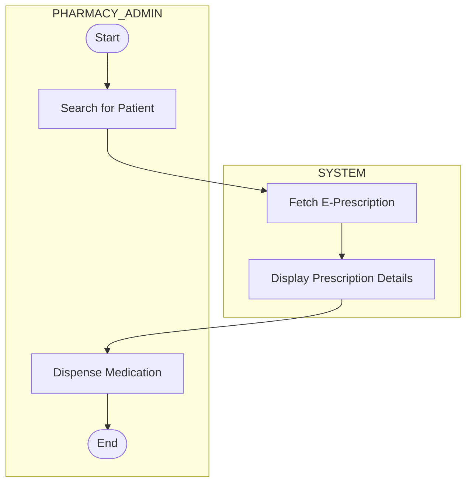
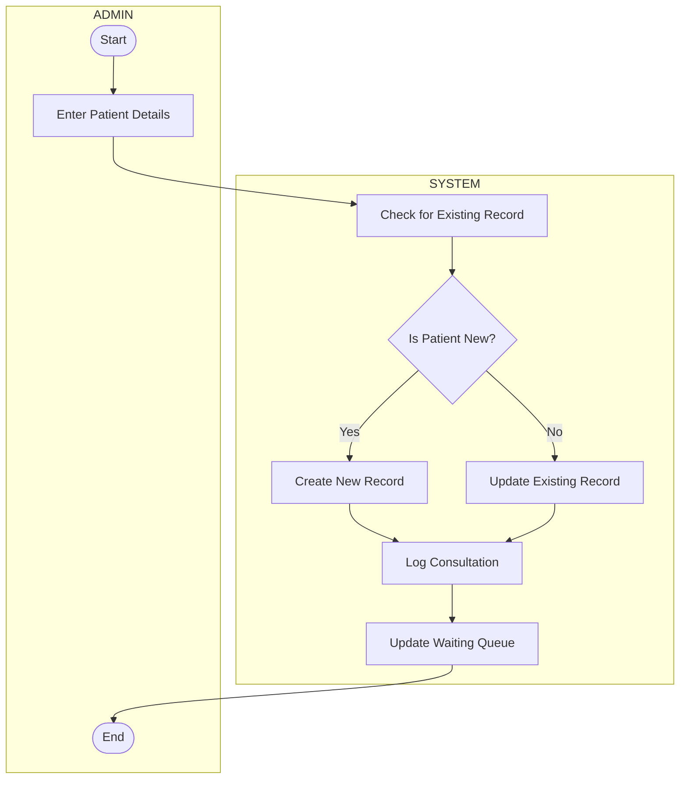
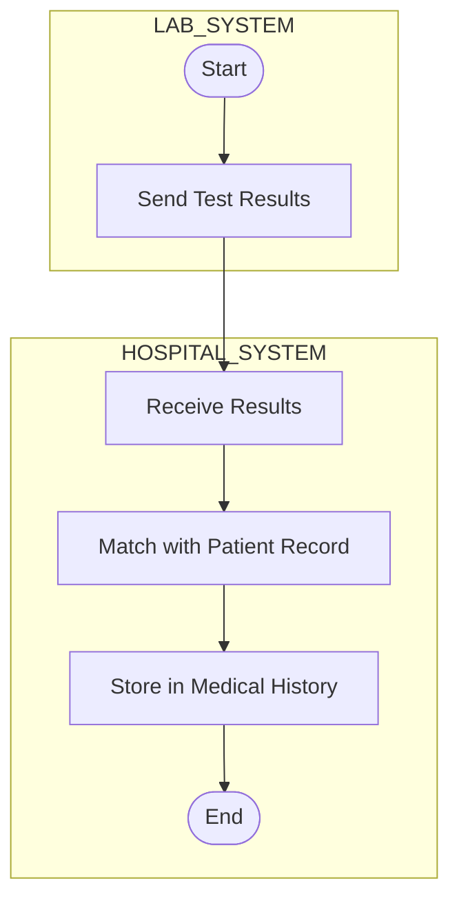
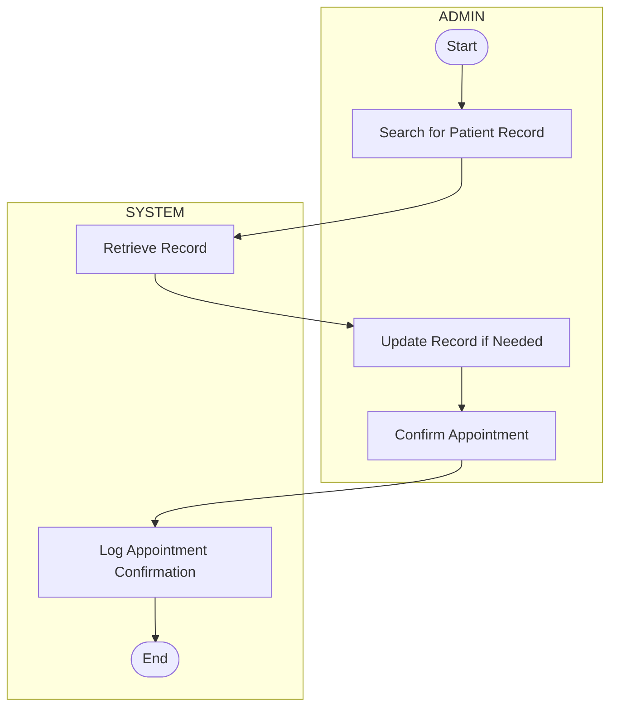

# UML Activity Workflow Diagrams with Explaination of how the workflow addresses stakeholder concerns

---

## US-001: Patient Registration


### How it addresses stakeholder concerns:

This workflow addresses patients' concerns about long wait times and difficulty accessing their data. By validating input and creating profiles electronically, it minimizes manual filing errors and reduces delays. Administrators benefit from quicker file creation, helping the hospital scale efficiently.

---

## US-002: Patient Booking Appointments

### How it addresses stakeholder concerns: 

Patients can book or modify appointments easily, reducing wait times. Real-time availability checks avoid double-booking—a key concern for both patients and administrators. Automated reminders enhance patient engagement, reducing no-shows and supporting the hospital’s operational efficiency.

---

## US-003: Doctor Views Medical History

### How it addresses stakeholder concerns:   

Doctors get instant access to accurate patient histories, reducing diagnosis delays. Lab integration ensures up-to-date information, meeting the doctors' need for quick, comprehensive records retrieval within 5 seconds and with 95% accuracy.
   

---

## US-004: Nurse Administers Medication

### How it addresses stakeholder concerns: 

The workflow ensures that medication schedules are followed accurately. Nurses access and update logs in real time, reducing manual errors and meeting the 90% medication adherence target, a key metric for improving patient care.

---

## US-006: Finance Staff Processes Invoices

### How it addresses stakeholder concerns: 

The flow ensures efficient billing and claim submissions, improving billing accuracy and reducing rejections. Automated steps help finance staff meet the 90% claim success target and enhance cash flow reliability.

---

## US-007: Pharmacy Admin Views E-Prescription

### How it addresses stakeholder concerns: 

Clear digital prescriptions prevent dispensing errors due to illegible handwriting. By integrating e-prescriptions, the system improves accuracy and supports the pharmacist's ability to manage stock based on trends, enhancing service quality.

---

## US-009: Admin Registers Patient & Consultation

### How it addresses stakeholder concerns: 

Admins can handle new or returning patients efficiently. This reduces the occurrence of missing files and speeds up waiting room turnover—addressing their pain points around lost records and booking inefficiencies.

---

## US-010: Lab Sends Test Results

### How it addresses stakeholder concerns: 

Test results are automatically sent and stored, eliminating delays. Doctors benefit from integrated, timely lab data, enabling faster diagnosis and improving patient outcomes.

---

## US-011: Admin Manages Records

### How it addresses stakeholder concerns: 

Admins can easily search and update records, reducing missing file incidents. This enables quick appointment confirmations and improves administrative efficiency—addressing pain points around slow updates and overbooking.

---

## US-012: IT Staff Manages Roles
```mermaid
flowchart TD
    subgraph IT_STAFF
        L1([Start]) --> L2[Login to System]
        L2 --> L3[Navigate to User Management]
        L3 --> L4[Select Role Operation]
    end

    subgraph SYSTEM
        L4 --> L5[Apply Role Change (Add/Update/Delete)]
        L5 --> L6[Update User Permissions]
        L6 --> L7([End])
    end
```
### How it addresses stakeholder concerns: 
Role-based access ensures security and operational integrity. The workflow aligns with compliance needs and ensures IT staff can maintain and update user roles efficiently with minimal downtime.
