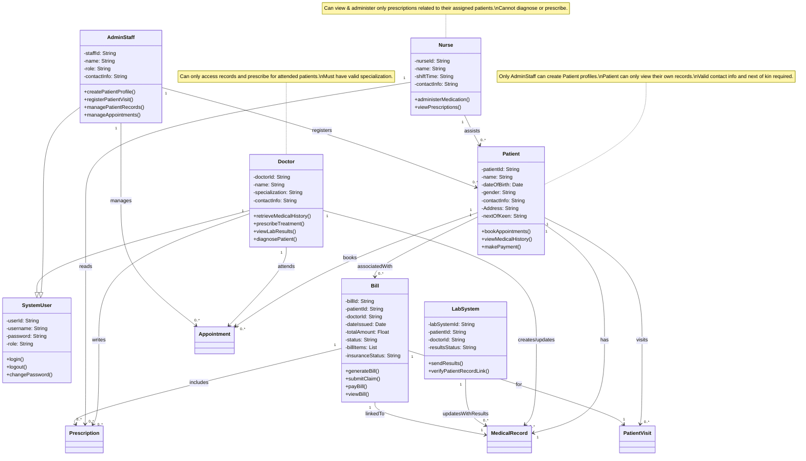

```mermaid
classDiagram

%%==================
%% CLASS DEFINITIONS
%%==================

class SystemUser {
  -userId: String
  -username: String
  -password: String
  -role: String
  +login()
  +logout()
  +changePassword()
}

class AdminStaff {
  -staffId: String
  -name: String
  -role: String
  -contactInfo: String
  +createPatientProfile()
  +registerPatientVisit()
  +managePatientRecords()
  +manageAppointments()
}

class Doctor {
  -doctorId: String
  -name: String
  -specialization: String
  -contactInfo: String
  +retrieveMedicalHistory()
  +prescribeTreatment()
  +viewLabResults()
  +diagnosePatient()
}

class Nurse {
  -nurseId: String
  -name: String
  -shiftTime: String
  -contactInfo: String
  +administerMedication()
  +viewPrescriptions()
}

class Patient {
  -patientId: String
  -name: String
  -dateOfBirth: Date
  -gender: String
  -contactInfo: String
  -Address: String
  -nextOfKeen: String
  +bookAppointments()
  +viewMedicalHistory()
  +makePayment()
}

class Bill {
  -billId: String
  -patientId: String
  -doctorId: String
  -dateIssued: Date
  -totalAmount: Float
  -status: String
  -billItems: List
  -insuranceStatus: String
  +generateBill()
  +submitClaim()
  +payBill()
  +viewBill()
}

class LabSystem {
  -labSystemId: String
  -patientId: String
  -doctorId: String
  -resultsStatus: String
  +sendResults()
  +verifyPatientRecordLink()
}

class MedicalRecord
class Appointment
class Prescription
class PatientVisit

%%==================
%% INHERITANCE
%%==================

AdminStaff --|> SystemUser
Doctor --|> SystemUser

%%==================
%% RELATIONSHIPS
%%==================

Patient "1" --> "0..*" Appointment : books
Patient "1" --> "0..*" Bill : associatedWith
Patient "1" --> "1" MedicalRecord : has
Patient "1" --> "0..*" PatientVisit : visits

Doctor "1" --> "0..*" MedicalRecord : creates/updates
Doctor "1" --> "0..*" Appointment : attends
Doctor "1" --> "0..*" Prescription : writes

Nurse "1" --> "0..*" Prescription : reads
Nurse "1" --> "0..*" Patient : assists

AdminStaff "1" --> "0..*" Patient : registers
AdminStaff "1" --> "0..*" Appointment : manages

LabSystem "1" --> "0..*" MedicalRecord : updatesWithResults

Bill "1" --> "0..*" Prescription : includes
Bill "1" --> "1" PatientVisit : for
Bill "1" --> "1" MedicalRecord : linkedTo

%%==================
%% NOTES
%%==================

note for Patient "Only AdminStaff can create Patient profiles.\nPatient can only view their own records.\nValid contact info and next of kin required."
note for Doctor "Can only access records and prescribe for attended patients.\nMust have valid specialization."
note for Nurse "Can view & administer only prescriptions related to their assigned patients.\nCannot diagnose or prescribe."
```
