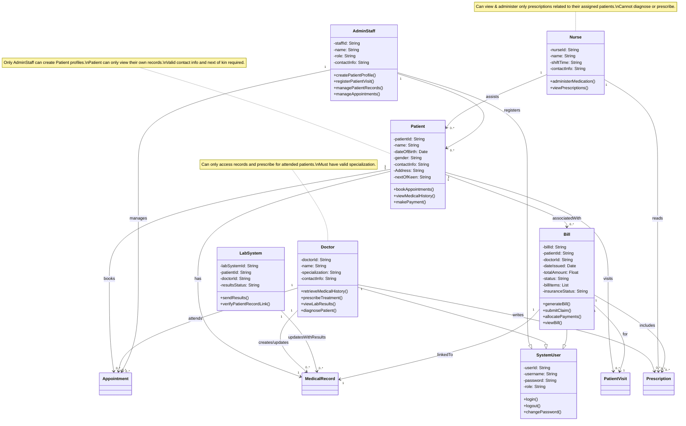

# Key Design Decisions

### 1. Inheritance Structure
- **`SystemUser`** is the base class for login and security features.
- **`Doctor`** and **`AdminStaff`** inherit from `SystemUser` due to their system access needs.
- **`Patient`** was not explicitly inherited to allow optional external access via a different interface.

### 2. Encapsulation of Responsibilities
- Each class contains only attributes and methods relevant to its role.
- For example:
  - **Doctor**: Medical tasks like prescribing and diagnosing.
  - **AdminStaff**: Patient profile creation and appointment handling.
  - **Nurse**: Medication administration based on prescriptions.

### 3. Relationships & Multiplicity
- Real-world constraints influenced the multiplicity:
  - A patient can have many bills and appointments.
  - A doctor can author many prescriptions.
- Multiplicities are explicitly labeled (e.g., `1`, `0..*`) to clarify these associations.

### 4. Composition vs. Association
- **Composition** is used where the relationship is tightly bound (e.g., `Patient` to `MedicalRecord`).
- **Associations** model looser relationships (e.g., `Bill` to `Prescription`).

### 5. Role-Based Access & Security
- System actions are restricted based on roles:
  - Only **doctors** can diagnose.
  - Only **nurses** can administer medication.
  - Only **AdminStaff** can create/edit patient profiles.
- These restrictions are captured through role-specific methods and class separation.

### 6. Modularity and Scalability
- Entities like `LabSystem`, `Prescription`, and `PatientVisit` are modeled as independent classes.
- This promotes modularity and allows easy expansion (e.g., adding pharmacy integration or insurance logic).

