# Stub implementation

```python
from repositories.patient_repository import PatientRepository
from models.patient import Patient
from typing import Optional, List

class DatabasePatientRepository(PatientRepository):
    def __init__(self, connection_string: str):
        self.connection_string = connection_string

    def save(self, entity: Patient) -> None:
        pass

    def find_by_id(self, id: str) -> Optional[Patient]:
        pass

    def find_all(self) -> List[Patient]:
        pass

    def delete(self, id: str) -> None:
        pass

```


# Updated Class Diagram

```mermaid

classDiagram

%% ==================================================
%% SYSTEM ENTITIES (Core hospital models)
%% ==================================================

class SystemUser {
  -userId: String
  -username: String
  -password: String
  -role: String
}

class AdminStaff {
  -staffId: String
  -name: String
  -role: String
  -contactInfo: String
}

class Doctor {
  -doctorId: String
  -name: String
  -specialization: String
  -contactInfo: String
}

class Nurse {
  -nurseId: String
  -name: String
  -shiftTime: String
  -contactInfo: String
}

class Patient {
  -patientId: String
  -name: String
  -age: int
  -gender: String
  -address: String
  -medicalHistory: String
}

class Appointment {
  -appointmentId: String
  -patientId: String
  -doctorId: String
  -department: String
  -appointmentDate: Date
  -appointmentTime: Time
}

class Invoice {
  -invoiceId: String
  -patientId: String
  -doctorId: String
  -amount: float
  -status: String
  -dateIssued: Date
}

class Bill {
  -billId: String
  -patientId: String
  -doctorId: String
  -totalAmount: float
  -status: String
  -insuranceStatus: String
}

class Prescription {
  -prescriptionId: String
  -patientId: String
  -doctorId: String
  -medicationDetails: String
}

class PatientTransfer {
  -patientId: String
  -transferFrom: String
  -transferTo: String
  -department: String
  -date: Date
}

class LabSystem {
  -labId: String
  -patientId: String
  -doctorId: String
  -labResults: String
  -dateCreated: Date
}

class MedicalRecord {
  -recordId: String
  -patientId: String
  -doctorId: String
  -diagnosis: String
  -treatment: String
  -dateCreated: Date
}

%% ==================================================
%% INHERITANCE (Roles)
%% ==================================================
AdminStaff --|> SystemUser
Doctor --|> SystemUser
Nurse --|> SystemUser

%% ==================================================
%% RELATIONSHIPS
%% ==================================================
Patient "1" --> "*" Appointment : "books"
Patient "1" --> "*" Bill : "has"
Patient "1" --> "1" MedicalRecord : "has"
Patient "1" --> "*" Prescription : "receives"

Doctor "1" --> "*" Appointment : "attends"
Doctor "1" --> "*" Prescription : "writes"
Doctor "1" --> "*" MedicalRecord : "updates"
Doctor "1" --> "*" LabSystem : "orders"

LabSystem "1" --> "*" MedicalRecord : "updates"

%% ==================================================
%% REPOSITORY INTERFACES (Persistence Layer)
%% ==================================================

class Repository~T, ID~ {
  +save(entity: T)
  +findById(id: ID)
  +findAll()
  +delete(id: ID)
}

class PatientRepository
class AppointmentRepository
class BillRepository
class InvoiceRepository
class PrescriptionRepository
class MedicalRecordRepository
class LabSystemRepository
class PatientTransferRepository

Repository <|-- PatientRepository
Repository <|-- AppointmentRepository
Repository <|-- BillRepository
Repository <|-- InvoiceRepository
Repository <|-- PrescriptionRepository
Repository <|-- MedicalRecordRepository
Repository <|-- LabSystemRepository
Repository <|-- PatientTransferRepository

%% ==================================================
%% STORAGE IMPLEMENTATIONS (In-Memory & Database)
%% ==================================================

class InMemoryPatientRepository
class DatabasePatientRepository
PatientRepository <|-- InMemoryPatientRepository
PatientRepository <|-- DatabasePatientRepository

class InMemoryAppointmentRepository
class DatabaseAppointmentRepository
AppointmentRepository <|-- InMemoryAppointmentRepository
AppointmentRepository <|-- DatabaseAppointmentRepository

class InMemoryBillRepository
class DatabaseBillRepository
BillRepository <|-- InMemoryBillRepository
BillRepository <|-- DatabaseBillRepository

class InMemoryPrescriptionRepository
class DatabasePrescriptionRepository
PrescriptionRepository <|-- InMemoryPrescriptionRepository
PrescriptionRepository <|-- DatabasePrescriptionRepository

class InMemoryMedicalRecordRepository
class DatabaseMedicalRecordRepository
MedicalRecordRepository <|-- InMemoryMedicalRecordRepository
MedicalRecordRepository <|-- DatabaseMedicalRecordRepository

%% ==================================================
%% FACTORY
%% ==================================================
class RepositoryFactory {
  +get_repository(entity_class: Type) : Repository
}

RepositoryFactory --> InMemoryPatientRepository
RepositoryFactory --> InMemoryAppointmentRepository
RepositoryFactory --> InMemoryBillRepository
RepositoryFactory --> InMemoryPrescriptionRepository
RepositoryFactory --> InMemoryMedicalRecordRepository

```


