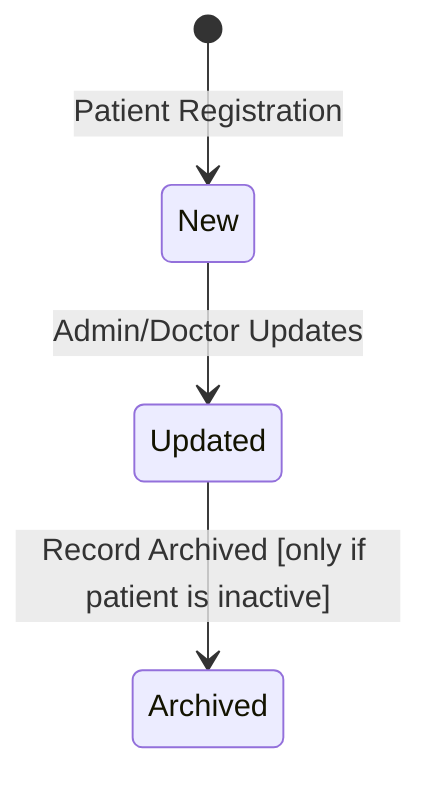
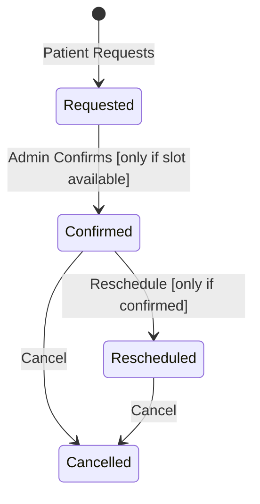
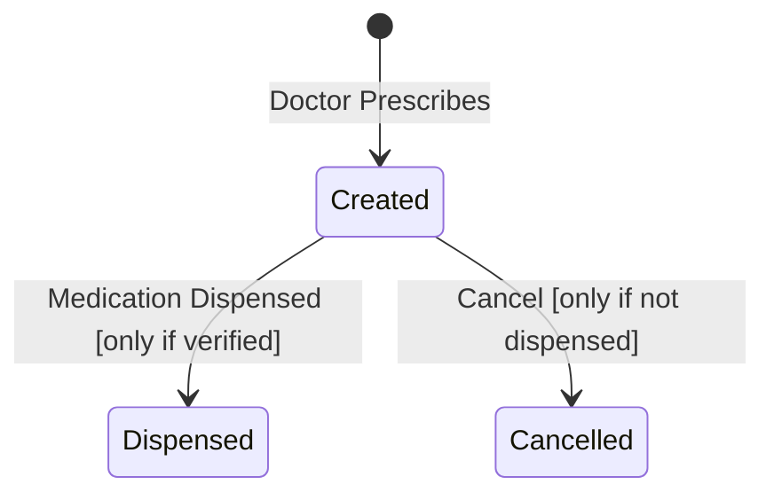
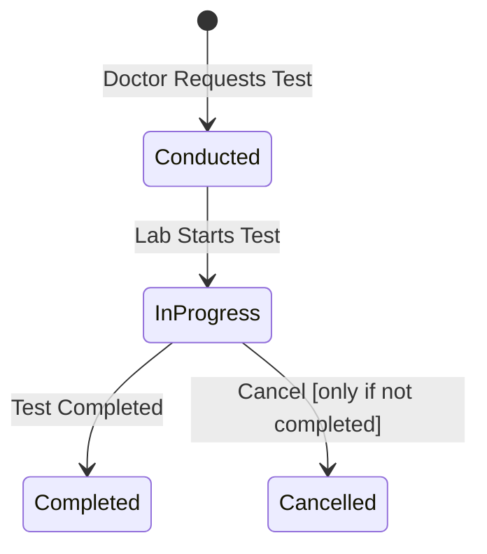
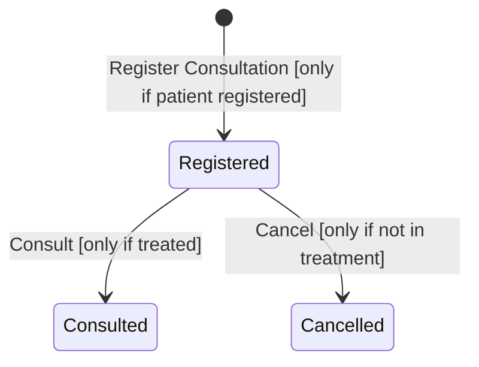
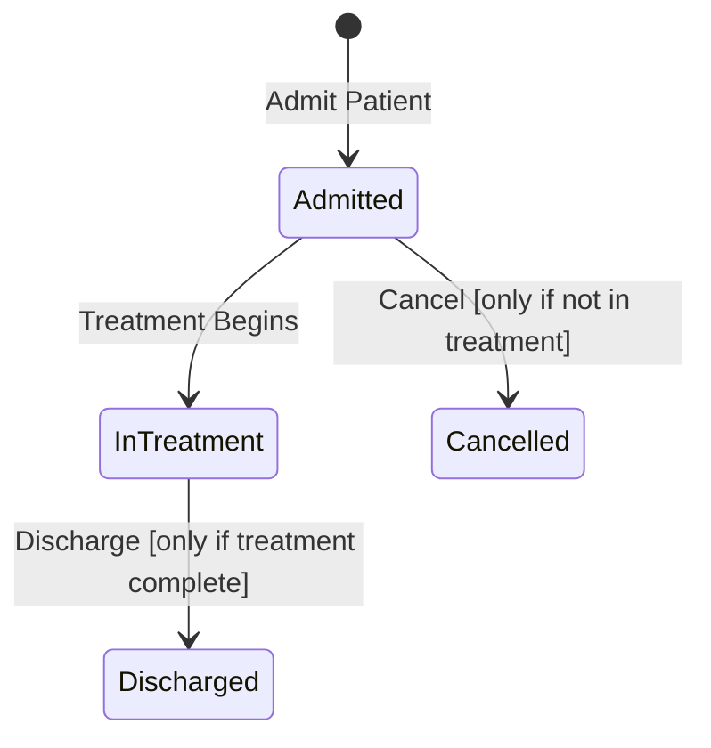
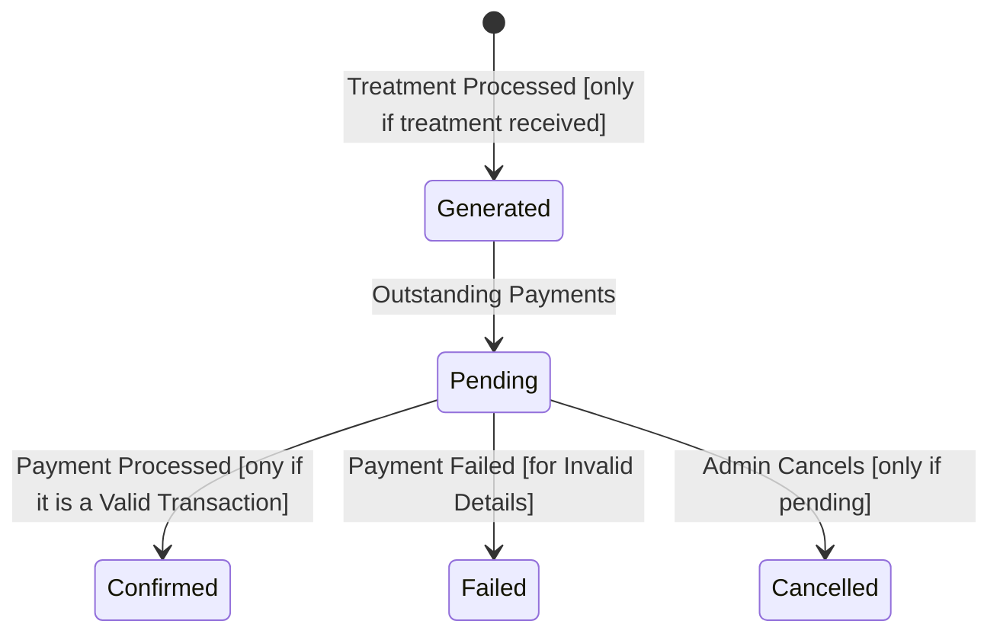
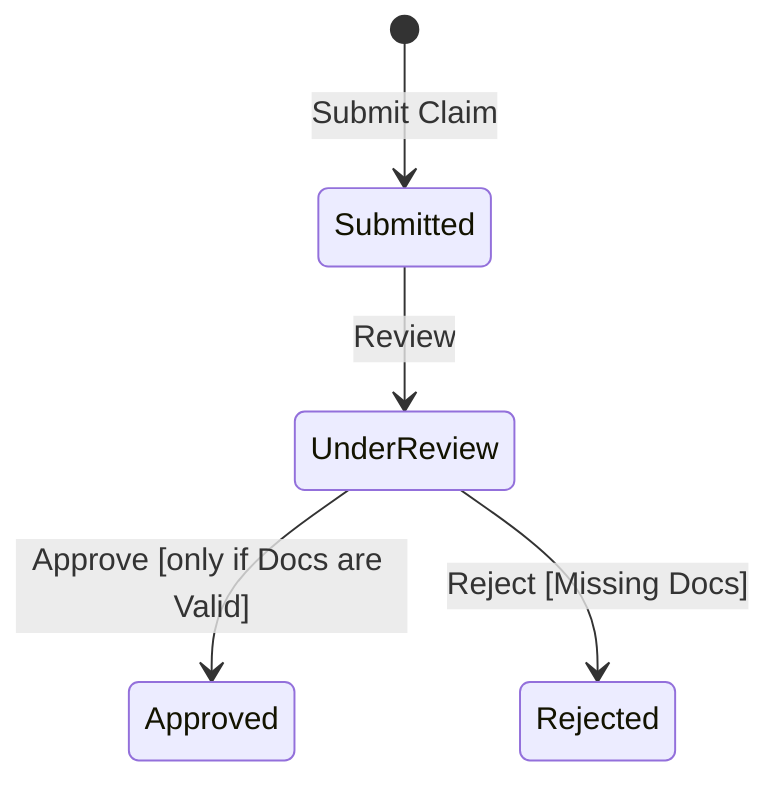
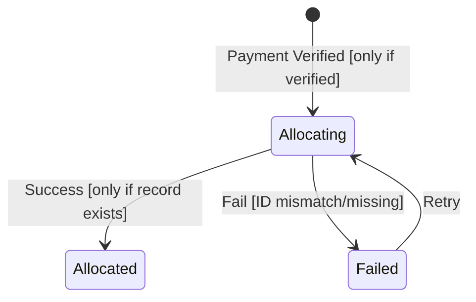

# State Transition Diagrams with Functional Requirements Mapping

Below are state transition diagrams, with detailed explanations for key states, transitions, and how each diagram maps to functional requirements from the Hospital Records Management System specification.

---

## 🟦 Patient Record

### Key States & Transitions
- **New**: Created when a patient is registered.
- **Updated**: Triggered when patient details are modified.
- **Archived**: Patient record is moved for inactive or past patients.

### Functional Requirement Mapping
- `New` supports **FR-001: Register new patients**.
- `Updated` aligns with **FR-003: Update patient records**.
- `Archived` maps to **FR-007: Archive inactive patient records**.

---

## 🟨 Appointment

### Key States & Transitions
- **Requested**: Patient initiates an appointment.
- **Confirmed**: Confirmed by admin.
- **Rescheduled**/**Cancelled**: Patient or admin can modify or cancel.

### Functional Requirement Mapping
- `Requested` fulfill **FR-011: Appointments Bookings**.
- `Confirmed` fulfill **FR-012: Manage Appointments**.
- `Rescheduled` supports **FR-011: Allow rescheduling of appointments**.
- `Cancelled` addresses **FR-011: Allow users to cancel appointments**.

---

## 🟩 Prescription

### Key States & Transitions
- **Created**: Prescription added by doctor.
- **Dispensed**: Medicine given to patient.
- **Cancelled**: Voided before dispensing.

### Functional Requirement Mapping
- `Created` maps to **FR-003: Doctor's Record prescriptions**.
- `Dispensed` fulfills **FR-008: Pharmacy dispatches medication**.
- `Cancelled` relates to **FR-004: Access to Prescriptions**.

---

## 🟫 Lab Test Order

### Key States & Transitions
- **Conducted**: Test ordered.
- **InProgress**: Test is ongoing.
- **Completed**/**Cancelled**: Final state based on test completion.

### Functional Requirement Mapping
- `Conducted` , `Completed` and `Cancelled`  fulfills **FR-006: Lab integration**.

---

## 🟪 Outpatient Visit

### Key States & Transitions
- **Registered**: Visit initiated.
- **Consulted**: Doctor completes consultation.
- **Cancelled**: Missed appointment or withdrawal.

### Functional Requirement Mapping
- `Registered` supports **FR-002: Register patient visits**.
- `Consulted` maps to **FR-003: Doctor will Record consultation outcomes**.
- `Cancelled` fulfills **FR-008: Allow patients to cancel appointments**.

---

## 🟥 Patient Admissions

### Key States & Transitions
- **Admitted**: Patient accepted into hospital.
- **InTreatment**: Treatment started.
- **Discharged**/**Cancelled**: End of admission.

### Functional Requirement Mapping
- `Admitted` aligns with ****FR002 and FR-003: Register admission visit based on doctor's diagnoses outcome**.
- `InTreatment`, `Discharged` and `Cancelled` fulfill **FR003: Doctor's diagonoses and treatments and FR010: Track patient status**.

---

## 🟧 Billing Invoice

### Key States & Transitions
- **Generated**: Invoice created after treatment.
- **Pending**: Awaiting payment.
- **Confirmed**, **Failed**, **Cancelled**: Outcome based on payment process.

### Functional Requirement Mapping
- `Generated` and `Cancelled` supports **FR-014: Generate invoices**.
- `Confirmed` and `Failed` align with **FR-015: Process payments**.

---

## 🟦 Insurance Claim

### Key States & Transitions
- **Submitted**: Insurance claim initiated.
- **UnderReview**: Under processing.
- **Approved**/**Rejected**: Based on validation.

### Functional Requirement Mapping
- `Submitted` supports **FR-017: Submit insurance claims**.
- `Approved` and `Rejected` fulfill **FR-018: Validate and track claims**.

---

## 🟩 Payment Allocation

### Key States & Transitions
- **Allocating**: In process of mapping payment.
- **Allocated**: Mapped successfully.
- **Failed**/**Retry**: Error or second attempt.

### Functional Requirement Mapping
- `Allocating` and `Allocated` map to **FR-016: Allocate payments to patient records**.
- `Failed` and `Retry` fulfill **FR-016: Handle payment allocation errors**.
